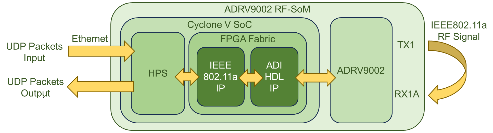
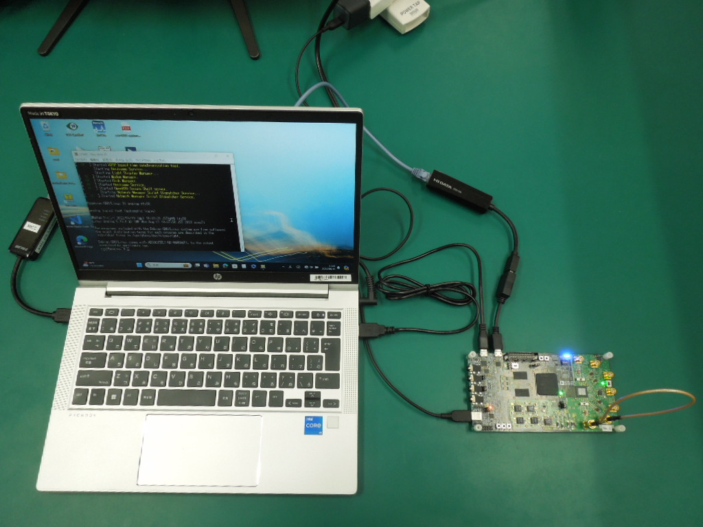
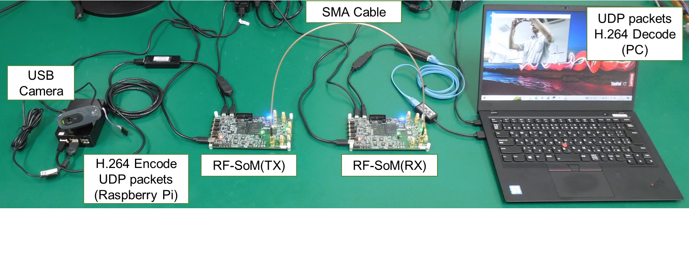

# How-to: Wireless LAN IEEE802.11a Demonstration

- [How-to: Wireless LAN IEEE802.11a Demonstration](#how-to-wireless-lan-ieee80211a-demonstration)
  - [1. Overview of this Demonstration](#1-overview-of-this-demonstration)
  - [2. Prerequisites](#2-prerequisites)
  - [3. Building the Demonstration Design](#3-building-the-demonstration-design)
  - [4. Hardware Setup](#4-hardware-setup)
  - [5. Software Setup](#5-software-setup)
  - [6. Running the Demonstration](#6-running-the-demonstration)
  - [7. Conclusion](#7-conclusion)


## 1. Overview of this Demonstration
In this demonstration, we use the ADRV9002 RF-SoM to transmit and receive IEEE802.11a signals.
The UDP packets are modulated by the IEEE802.11a PHY implemented in the RF-SoM's SoC and sent via Wireless LAN radio waves.
They are then received back, demodulated by the IEEE802.11a PHY, and converted back into UDP packets.
This demo transmits and receives only three lines of text via radio signals.




## 2. Prerequisites
  - 1× ADRV9002 RF-SoM
    - 1× USB A-microB cable for USB UART terminal
    - 1× USB OTG adapter
    - 1× USB-Ethernet adapter
    - 1× RJ-45 Ethernet cable (Cat5e or higher recommended)
    - 1× SMA RF cable
    - 1× SD card (Image prepared following [this page](https://github.com/MarimoElectronics/Yonaguni-docs/blob/main/How-toSD.md))
  - 1× PC
    - 1× RJ-45 Ethernet port
    - 1× USB-A port for UART terminal
    - 1× SD card writer
  - Quartus Prime Lite Edition 20.1.1


## 3. Building the Demonstration Design
First, clone the Yonaguni-demo and Yonaguni-FPGA repositories.
Then, copy the Yonaguni-FPGA/hdl directory to yonaguni_wlan11a_demo/ip.

```Shell
$ git clone https://github.com/MarimoElectronics/Yonaguni-demo.git
$ git clone https://github.com/MarimoElectronics/Yonaguni-FPGA.git
$ cp -r ./Yonaguni-FPGA/hdl ./Yonaguni-demos/yonaguni_wlan11a_demo/ip/
```

Next, build the demonstration design using Quartus Prime:
  - Launch Quartus Prime and open the project file "yonaguni_lvds.qpf" in the yonaguni_wlan11a_demo directory.
  - In Quartus, launch "Platform Designer" and select "system_bd.qsys".
  - In Platform Designer, run "Generate > Generate HDL...".
  - Run "Start Compilation" in Quartus.
  - Write the "yonaguni_lvds.rbf" file, created in the "output_files" folder, to the BOOT partition of the SD card.
  - Change the file name to "yonaguni_cmos.rbf".


## 4. Hardware Setup
Connect the RF-SoM to a PC.
  - Use an Ethernet cable and a USB UART cable to connect the PC to the RF-SoM.
  - Connect the RF-SoM's TX1_OUT (CN2) and RX1A_IN (CN6) using an SMA cable.



Set the PC's IP address to 192.168.1.229.
(If necessary, disable your PC's firewall.)

Power on the RF-SoM and set its IP address via the USB UART Terminal.
(If necessary, disable dhcpcd on the RF-SoM.)
```Shell
root@analog:~ $ ifconfig eth0 192.168.1.228
```


## 5. Software Setup
Log in to the RF-SoM via SSH. The default login password is "analog".

Create a directory named yonaguni_wlan11a_demo under /home/analog.

Copy the SW directory from the cloned Yonaguni-demos/yonaguni_wlan11a_demo to the yonaguni_wlan11a_demo directory on the RF-SoM.

Navigate to yonaguni_wlan11a_demo/SW/01_TRX and run make to generate the TEST_PRG.
```Shell
analog@analog:~/yoneguni_wlan11a_demo/SW/01_TRX $ make
gcc -c main.c -Wall
gcc main.o  -Wall -o TEST_PRG
analog@analog:~/yoneguni_wlan11a_demo/SW/01_TRX $
cd ~
analog@analog:~ $
```


## 6. Running the Demonstration
Run the startup script via SSH. The login password is "analog".
```Shell
analog@analog:~ $ sudo sh /home/analog/yonaguni_wlan11a_demo/SW/wlan11a_startup.sh
[sudo] password for analog:
----------------------------------------------------------------------
------ WLAN11a transmit and receive program. ------
INFO-> Setup FPGA interface... finished.
INFO-> Initialize RF wideband transceiver(ADRV9002)... finished.
INFO-> Source IP address is 192.168.1.229
INFO-> ready...
```

If an error occurs during startup, before the "ready..." screen appears, a "cat: error message" will be displayed and the program will automatically retry.
After a while, USER_LED[3] on the RF-SoM will flash blue, indicating successful boot.

Next, on your PC, run UDP_receive.py in the cloned Yonaguni-demo/yonaguni_wlan11a_demo/python directory.
The PC will wait for UDP packets received and demodulated via IEEE802.11a.

Then, run UDP_send.py.

The following is an example run on Windows PowerShell.
```Shell
c:\work\yonaguni_wlan11a_demo\Python> .\UDP_receive.py
c:\work\yonaguni_wlan11a_demo\Python> .\UDP_send.py
```
When IEEE802.11a transmission occurs, USER_LED[0] on the RF-SoM lights up blue, and when reception occurs, USER_LED[1] lights up blue.

The received text will look like this:
```Shell
hello RF-SOM0
hello RF-SOM1
hello RF-SOM2
```

Press ^C via SSH to end the wlan11a_startup.sh script.

Close the Windows PowerShell.


## 7. Conclusion
In this demonstration, UDP packets were converted into wireless signals and transmitted/received using the IEEE802.11a PHY implemented in the ADRV9002 RF-SoM.
This demonstration can be applied to transmit and receive image data by compressing images from a USB camera, converting them into UDP packets, transmitting them wirelessly, and then demodulating and decompressing them on the receiving side.


